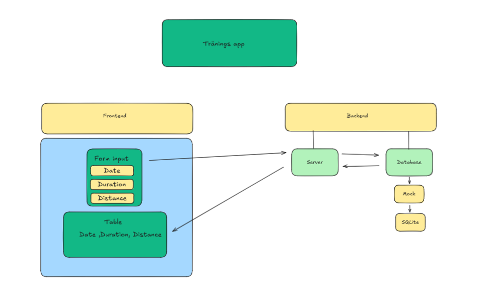

# Traning-app
Description

The Running Log Application allows users to log their running sessions by recording the time, date, and distance of each run. These sessions are stored in an SQLite database and displayed in a table format on the webpage.

Big picture plan

Planning Board

Link: https://github.com/users/martensoderlind/projects/2/views/1

Features

    Add running sessions with details such as time, date, and distance.
    View logged sessions in a structured table.
    Data is stored persistently using SQLite.

Technologies Used

    HTML/PicoCss
    Typescript
    Node.js
    SQLite

SQLite

SQLite is a self-contained, serverless, zero-configuration, and transactional SQL database engine. It is widely used due to its simplicity and ease of integration into applications. In this project, I learned how to set up an SQLite database, create tables, and perform CRUD (Create, Read, Update, Delete) operations using the library better-sqlite3 (https://www.npmjs.com/package/better-sqlite3).

What I Learned:

    How to connect to an SQLite database using Node.js.
    Creating tables and managing schemas for data storage.
    Performing SQL queries to retrieve data.
    Error handling and data validation during database operations.
